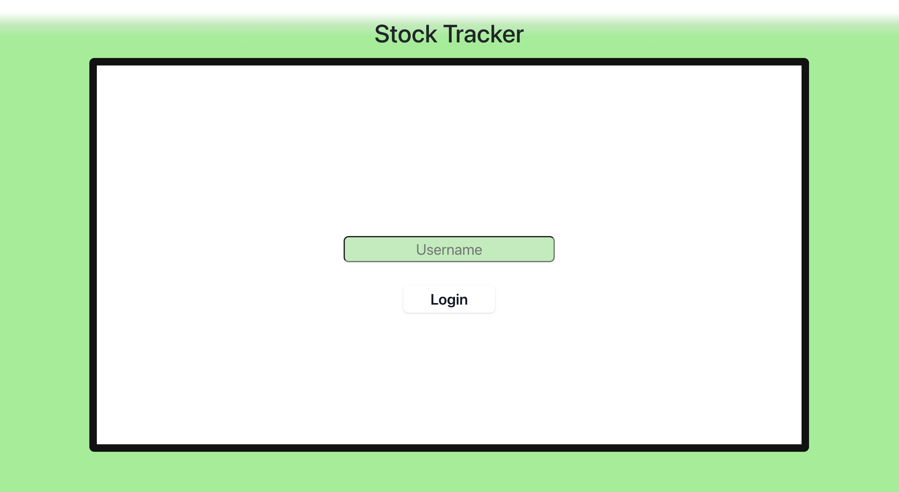
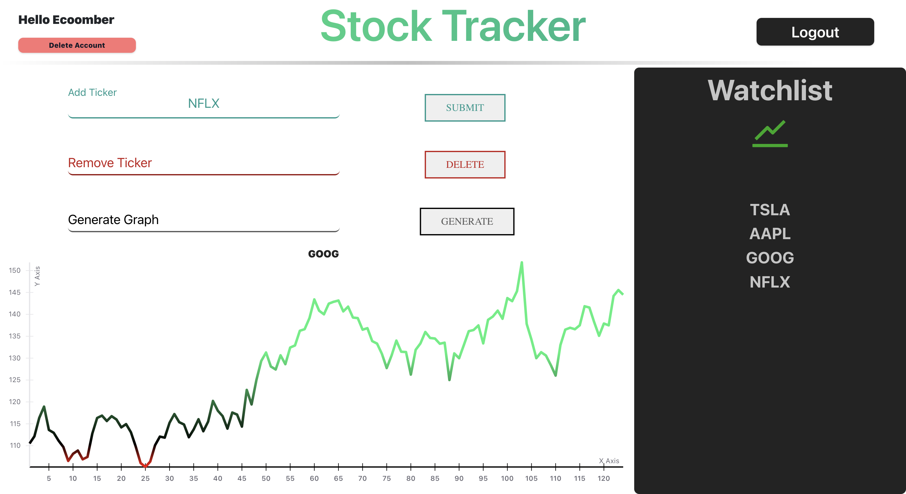

# Stock
This is a website that lets you look at and track stocks. Users log in with a username and it brings them to their page.

Database: PostgreSQL
Backend: SpringBoot 
Frontend: React

Here is the deployed link
https://stock-frontend-nine.vercel.app/

Login page:

Profile page:

### References
https://rapidapi.com/belchiorarkad-FqvHs2EDOtP/api/yh-finance-complete
Provided the stock API

https://uber.github.io/react-vis/documentation/getting-started/installing-react-vis
React-vis for creating graphs

https://getcssscan.com/css-buttons-examples
Button

https://morioh.com/p/xWmnEHhoWDqX
Link that helped with deploying the backend to Heroku
